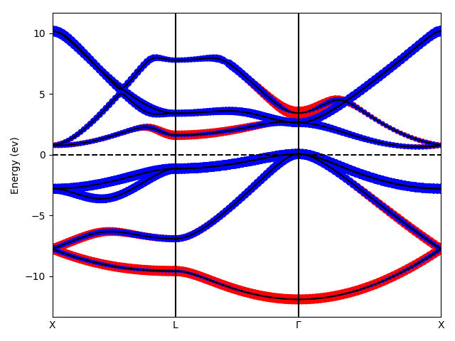
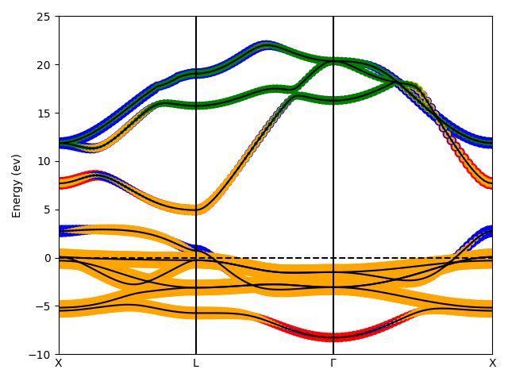

本文介绍 WIEN2k 中自旋非极化下通过 LAPWSO 考虑自旋轨道耦合(SOC)效应的第一性原理
计算的流程. 以 Si 和 Au 为例子, 简单分析 SOC 对能带结构的影响.

## WIEN2k 中实现的 SOC

WIEN2k 中价层轨道的 SOC 贡献是通过 LAPWSO 程序考虑的.
它基于一种所谓的二次变分[^1]的方法,
通过读取 LAPW1 计算的本征态的波函数与能量,
计算微扰 $\hat{H}_{\rm SO}$ 的矩阵元并对角化, 得到包含 SOC 的波函数与能量.
LAPWSO 可以包含在 SCF 循环里, 也可以非自洽地运行.

## 实际例子

### diamond Si

以 diamond Si (10.405822 au)为例, RMT 取 1.8. 初始化命令

```bash
init_lapw -b -numk 64
```

体系共 8 个价电子. 先看不加 SOC 的结果. 执行

```bash
run_lapw -ec 0.0000001
```

仔细检查 energy 文件. 在第 1 个和第 7 个 k 点,
由能带 4 和 5 分别为价带和导带, 得到带隙为 0.780 eV,
涉及 k 矢跃迁为 000($\Gamma$)-100(X).

```plain
...
 0.000000000000E+00 0.000000000000E+00 0.000000000000E+00         1   291    15  1.0
           1 -0.476709975533258
           2  0.382390732021062
           3  0.382390732021068
           4  0.382390732021068
           5  0.567940696174970
           6  0.567940696174970
           7  0.567940696174976
           8  0.594331247119800
...
 1.000000000000E+00 0.000000000000E+00 0.000000000000E+00         7   294    20  3.0
           1 -0.183034494762965
           2 -0.183034494762950
           3  0.180029340741516
           4  0.180029340741516
           5  0.439692381439167
           6  0.439692381439175
           7   1.09817099212224
           8   1.09817099212225
...
```

关于能带的组成, 考虑 $\Gamma$ 点上能带组分, 由 TB 分析可知, 
上面 8 个能级从低到高依次是 Si 的 
$\sigma({3s})$, $\{\sigma/\pi\}({3p})$, $\{\sigma/\pi\}^\ast({3p})$ 和 $\sigma^\ast({3s})$.
在一条 k 点路径上的组分变化可以从这张 VASP 计算的投影能带图 [1](#fig:Si_X-L-G-X) 看出.


_Figure 1: Si 投影能带图. 红色为 s 成分, 蓝色为 p 成分._

上面这些都是对于无 SOC 的计算结果的分析. 下面利用 LAPWSO 微扰地考虑 SOC.
首先用 `save_lapw` 保存上面的计算结果,
然后运行 `initso` 命令以初始化 `lapwso` 所需的主要输入文件 `Si.inso`

```bash
save_lapw -d scf-no-soc
initso
```

`initso` 是交互式命令, 会询问下面几个设置

1. 指定 Direction of moment
2. 指定某些原子不考虑 SOC
3. 修改考虑 SOC 的能带的最高能量(EMAX)
4. 是否在 `case.in1` 中添加 RLO
5. 选择自旋极化方式. 因为在自旋极化情况下考虑 SOC 时, 体系的对称性有可能小于无 SOC 的情形. 如果选择 `y`, `symmetso` 程序将被执行, 确定考虑 SOC 后体系的对称性并修改 `struct` 文件.

暂时不深究几个问题的含义, 一路回车通关. 结束后执行

```bash
run_lapw -ec 0.0000001 -so
```

开始运行包含 LAPWSO 在内的 SCF 循环.

包含 SOC 的哈密顿量对角化后得到的本征值保存在 `case.energyso` 中.
与非极化计算的 `case.energy` 文件不同的是, 
SOC 下不再有简单的自旋简并, 
因此原则上各 k 点的能带数量是无 SOC 时的两倍.
还是看第 1 和第 7 个 k 点的能量

```plain
...
 0.000000000000E+00 0.000000000000E+00 0.000000000000E+00         1   291    30  1.0
...
           1 -0.476709708261459
           2 -0.476709708261458
           3  0.380103284844223
           4  0.380103284844224
           5  0.383531827460128
           6  0.383531827460128
           7  0.383531827479756
           8  0.383531827479756
           9  0.566261029915788
          10  0.566261029915788
          11  0.568777497161570
          12  0.568777497161571
          13  0.568777497196808
          14  0.568777497196810
          15  0.594331439770928
          16  0.594331439770930
...
 0.100000000000E+01 0.000000000000E+00 0.000000000000E+00         7   294    28  3.0
           1 -0.183035347355239
           2 -0.183035347355239
           3 -0.183035347355239
           4 -0.183035347355237
           5  0.180025326616621
           6  0.180025326616621
           7  0.180025326616631
           8  0.180025326616633
           9  0.439692350006189
          10  0.439692350006189
          11  0.439692350006200
          12  0.439692350006200
          13   1.09815900469418
          14   1.09815900469418
          15   1.09815900469536
          16   1.09815900469536
...
```

此时的价带和导带变成了 8 和 9, 带隙为 0.764 eV.
此外, $\Gamma$ 点上原来三重简并的 3p 成键与反键轨道均裂分为两组简并轨道,
能量较高的为四重简并, 较低的为二重简并.
考虑 SOC 后的带隙相比未考虑的情形只减小了 0.016 eV,
反映出在 Si 等轻元素中相对论效应较弱的事实.

### FCC Au

以 FCC Au (7.67 au)为例, 参考 Novak 老师的关于 spin-orbit coupling 笔记中的计算[^2]. RMT 值取 2.6, GMAX 取 16. 初始化命令

```bash
init_lapw -b -numk 5000 -rkmax 9
sed -i 's/ 12.00/ 16.00/g' Au.in2 # change GMAX
```

共 17 个价电子. 按和 Si 中相同的步骤, 
分别进行无 SOC 和在 LAPWSO 下考虑 SOC 的计算.
直接对比 $\Gamma$ 点上的能量. 先看无 SOC 的结果

```plain
 0.000000000000E+00 0.000000000000E+00 0.000000000000E+00         1    77    13  1.0
           1  -3.48417834812053
           2  -3.48417834812053
           3  -3.48417834812053
           4 -4.633683657763327E-002
           5  0.341371911764138
           6  0.341371911764145
           7  0.341371911764145
           8  0.456634603361144
           9  0.456634603361151
          10   1.75774908584153
          11   2.06272605171851
          12   2.06272605171851
          13   2.06272605171851
```

VASP 的投影能带如图 [2](#fig:Au_X-L-G-X) 所示. 从成分上看, 占据态分别是$5p$(1-3), $6s$(4), $t_{2g}$(5-7), $e_g$(8-9).


_Figure 2: Au 投影能带图. 红蓝黄绿色分别为 spdf 成分._

再看考虑 SOC 后的结果 `energyso`. 由于轨道增加一倍, 下面的 18 个轨道都是占据态[^3].
很明显的, 原来的 $t_{2g}$ 和 $e_g$ 进一步裂分成了三组轨道, 能量从低到高的简并度分别为 4, 2 和 4,
它们在群表示上的记号分别为 $\Gamma_8, \Gamma_7$和 $\Gamma'_8$.

```plain
 0.000000000000E+00 0.000000000000E+00 0.000000000000E+00         1    77    18  1.0
           1  -4.20742280553107
           2  -4.20742280553106
           3  -3.14951843978248
           4  -3.14951843978248
           5  -3.14951842668932
           6  -3.14951842668932
           7 -4.585036452752571E-002
           8 -4.585036452752490E-002
           9  0.294994273106371
          10  0.294994273106371
          11  0.294994274995205
          12  0.294994274995205
          13  0.381494069224123
          14  0.381494069224123
          15  0.473340026931149
          16  0.473340026931150
          17  0.473340027624113
          18  0.473340027624115
```

考虑和不考虑 SOC 的 $E_F $分别为 0.705 和 0.699 Ry
同 Novak 老师的能带位置结果 (下表括号内数字) 进行比较,
发现结果惊人一致 (Novak 老师的结果可还是用 WIEN97 算的啊).

| $E-E_F$ (mRy) |    No SOC    | SOC by LAPWSO |
| :-----------: | :----------: | :-----------: |
|  $\Gamma_8$   | -358  (-357) |  -410 (-410)  |
|  $\Gamma_7$   | -358  (-357) |  -324 (-323)  |
|  $\Gamma'_8$  | -242  (-241) |  -232 (-230)  |
{: .center}

-----

[^1]: [Second variation](http://www.encyclopediaofmath.org/index.php?title=Second_variation&oldid=31231). Encyclopedia of Mathematics.
[^2]: Prof. P. Novak, [Notes about spin-orbit](http://susi.theochem.tuwien.ac.at/reg_user/textbooks/novak_lecture_on_spinorbit.pdf), p12. 内容基于 WIEN97.
[^3]: 可以通过增大 `inso` 中的 `EMAX` 来获取更多的 SOC 态的本征值
