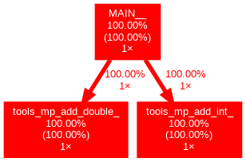
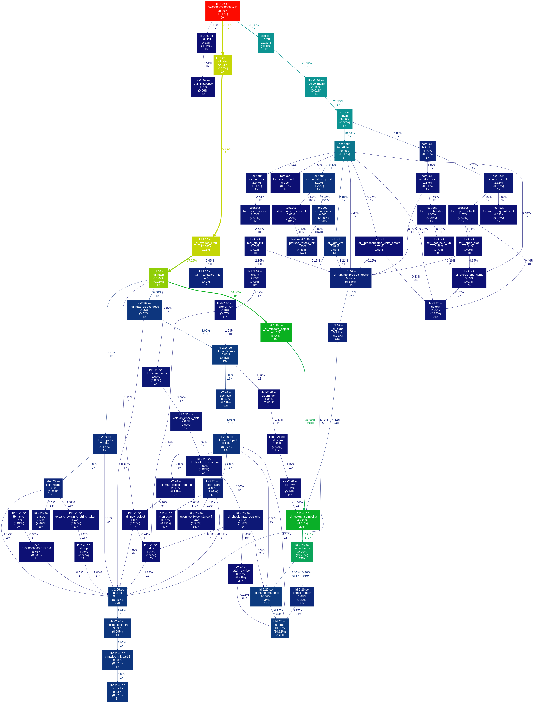
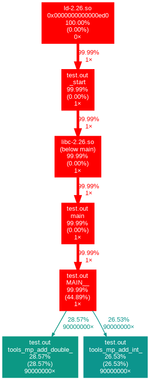
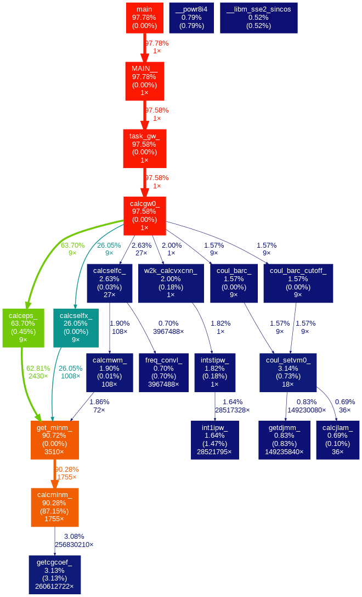

## 背景

程序逻辑或者工作流是程序设计中很重要的部分, 与程序的算法实现及效率紧密相关.
通过分析程序运行中函数的调用顺序和次数等, 可以发现程序中可能存在的设计缺陷和性能瓶颈.
调用图 ([call graph](https://en.wikipedia.org/wiki/Call_graph)) 是一种展示程序工作流的手段, 包括静态和运行时两种, 前者侧重调用逻辑, 后者侧重实际工作环境中的时间效率.

之前写代码时一直不是很重视设计这个阶段, 最多用心灵导图稍微画一画需求, 也不是非常严格.
这导致过一段时间回看代码, 会对某些地方为什么要那么写产生疑问,
要想很久才能回忆起来, 很费时间. 这对于个人小型项目问题还好, 对中型或大型项目就会造成很大的困难.
在一顿无望的结果测试后, 最近我重新回到组里 GAP3 的开发里. 尽管理解工作流程,
但对于 GAP3 的 *GW* 计算如何调用它的各种例程, 仍然没有非常清晰的图象.
于是我希望能用调用图来把程序运行逻辑可视化, 帮助自己理清思路.
网上一顿搜索后, 发现可以用 gprof 和 Valgrind 来做性能分析, 用 gprof2dot 和`dot`来处理分析数据并作图.

这篇文章是自学的一些总结. 以下所有操作都是在 Linux (Fedora 27) 下完成, 用到的主要工具是

- Fortran 编译器与链接器: 这里使用 Intel 2018 Update 1 的 `ifort`
- [gprof](https://sourceware.org/binutils/docs/gprof/): 用于分析编译器产生的性能分析文件
- Valgrind: [Memcheck 初探]()一文提到了使用 Valgrind 的 memcheck 工具检测内存使用状况, 实际上它还提供了 `callgrind` 工具来进行函数调用的运行时分析.
- [gprof2dot](https://github.com/jrfonseca/gprof2dot):
  将 `gprof` 或 `callgrind` 分析获得的信息转化成一个以 [DOT 语言](https://en.wikipedia.org/wiki/DOT_(graph_description_language))描述的有向图 (directed graph) 对象. 可以通过 `pip` 安装.
- `dot`: 利用 Graphviz 将 DOT 有向图对象渲染成图片, 属于 Graphviz 发行版的一部分.

## 一个接口调用的例子

先从一个简单的例子出发, 把调用图制作的逻辑弄清楚. 下面是一段简单的做整数与浮点数加法的 Fortran 代码

```fortran
! filename: hw.f90
module tools
    interface add
        module procedure add_int
        module procedure add_double
    end interface add

    contains

        function add_int(i, j)
            integer, intent(in) :: i
            integer, intent(in) :: j
            integer :: add_int

            add_int = i +j
        end function add_int

        function add_double(i, j)
            real(8), intent(in) :: i
            real(8), intent(in) :: j
            real(8) :: add_double

            add_double = i +j
        end function add_double
end module

program hw

    use tools

    integer :: i
    real(8) :: x
    character(len=20) :: str = "Hello World!"

    write(*, "(A20)") str
    i = add(1, 2)
    x = add(1.1d0, 2.1d0)
    write(*, "(I2)") i
    write(*, "(F6.3)") x

    stop

end program hw
```

在这里, 主程序中调用的 `add` 函数实际上是一个接口, 当接受两个整数时重载为 `add_int`,
接受两个双精度浮点数是重载为 `add_double`.
下面分别用 gprof 和 valgrind 为后端, 进行性能分析和调用图的制作.

### 使用 gprof

首先, 要使用 `gprof`, 需要在程序编译时添加 `-p` 或 `-pg` 选项

```bash
ifort -p -g -c hw.f90 -o hw.o
ifort -o test.out hw.o -p
```

这里先编译到目标文件, 再链接到可执行文件. 然后运行 test.out

```bash
./test.out
```

产生 gmon.out 文件. 用 `gprof` 读取这一文件并将标准输出重定向

```bash
gprof test.out > gprof_test.txt
```

`gprof_test.txt` 中包含了运行 `test.out` 过程中各函数的调用次数, 程序在每个函数及其子函数中的停留时间等.
接下来使用`gprof2dot`处理 gprof_test.out

```bash
cat gprof_test.out | gprof2dot -f prof -o digraph.dot
```

digraph.out 用一个 `digraph` 数据类型描述了一个有向图.
用 `dot` 处理该文件并产生

```bash
cat digraph.dot | dot -Tpng -o hw_gprof.png
```

得到下图. 可以看到 `MAIN` 中各调用了一次 `add_int` 和 `add_double`. 
每个方块中第一个百分数是在该函数及其子函数的运行时间占程序总时间的比例,
第二个数是仅在该函数内的时间的比例.
这里全都是 100%, 是因为计算时间太短了, `gprof_test.out` 里的时间都是 0.00.


_单次加法调用 hw.f90 的 gprof 调用图_

试着将加法次数增大到九千万次, 就可以看到明显的不同. 双精度耗时比整型的还是要多一些.


_9 kw 加法调用 hw.f90 的 gprof 调用图_

### 使用 callgrind

若用 Valgrind 来做生成性能分析, 只需使用 `valgrind` 调用欲测试函数,
同时指明 callgrind 工具, 而不需要对编译做特别的改动

```bash
valgrind --tool=callgrind ./test.out
```

运行结束后会产生名为 `callgrind.out.xxx` 的文件, 其中 `xxx` 是运行程序进程的 PID.
使用 gprof2dot 分析

```bash
cat callgrind.out.xxx | gprof2dot -f callgrind -o digraph.dot
```

生成 png 的命令与前面 gprof 的相同.
当只调用一次加法时调用图如下, 出现很多复杂的库函数调用,
猜测应该跟 valgrind 本身有关, 反而看不到 `add_int` 和 `add_double`.
这时并不表示这两个函数未被调用, 而是因为占用时间太少, 被 gprof2dot 剪裁掉了.


_单次加法调用 hw.f90 的 callgrind 调用图_

提高到九千万次调用后的分析结果看上去正常一些. 同样的, 这也不是说那些库函数未被调用,
而是在这种情况下主要耗时都在加法上, 库函数调用耗时少而被 gprof2dot 去掉了.
这些都是视觉表现上的考虑.


_9 kw 加法调用 hw.f90 的 callgrind 调用图_

比较两种工具所得的调用图, 发现 Valgrind 能给出包含被调用函数所在库的名称.
在九千万次加法的例子里, 使用 Valgrind 做性能分析所花的时间比 gprof 要多得多, 因此还是
决定用 gprof 来做 GAP3 的分析. 上面用的所有程序和 Makefile 打包在[这里](fortran-profile.tar.gz)了.

## GAP3 的调用图

在 `-O3` 下编译串行程序, 用 `gprof` 做运行时分析, 在真空层为 9 Bohr 的单层六方 BN 中测试.
库仑截断的开关打开, 以检查工作流是否跟自己预想的相同. 最后得到调用图如下所示.


_-O3 下 GAP3 中 GW 功能的调用图_

可以得到的比较直接的结论是

1. 花费时间最多的上层例程是: 介电矩阵计算 `calceps` (63.70%), 交换自能即 Fock 算符 `calcselfx` (26.05%), 关联自能 `calcselfc` (2.63%).
2. 花费时间最多的底层例程是 `calcminm` (90.28%), 用于计算 KS 波函数积与 MPB 的重叠矩阵元 $M_{nm}^i(k, q)$.
   原则上计算量是 $\mathcal{O}(N_{\chi} N N_e N_v N_k^2)$,
   其中 $N_{\chi}$ 是 MPB 数量, $N$ 是 APW+LO 基组数, 价态数量 $N_v$, 电子总数 $N_e$, BZ 中 k 布点数 $N_k$.

另外发现的一个问题是, 在开启库仑截断后, 所有的库仑势计算都应该用
`coul_barc_cutoff` 例程, 但依然有 9 次 `coul_barc` 调用,
因此库仑势计算比关联自能更多一点. `coul_setvm0` 和 `calcmwm`也需要用带 cutoff 后缀的.
因此这样的调用图也能帮助解决一些流程控制上的 bug.

## 总结

在这篇文章中, 笔者分别用 gprof 和 callgrind 对一个简单的 Fortran 程序制作了调用图, 并通过调用图分析了GAP3程序中的性能瓶颈, 发现了库仑截断开启时的流程控制问题.

## 参考

- [valgrind的callgrind工具进行多线程性能分析](https://www.cnblogs.com/zengkefu/p/5642991.html)
