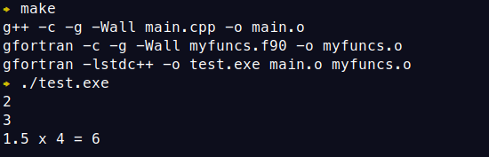
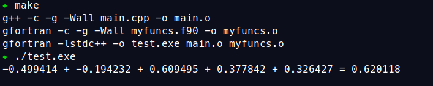
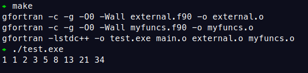

In this short blog, I would write down some snippets to show how to call
Fortran subroutines and functions from C++ program.
Three different cases are discussed.

## Case 1: subroutines/functions involving only scalars

We begin with some simple tasks
- increase the value of an integer variable by one 
- return the sum of two double-type variables

Solutions to the two tasks will be implemented in Fortran, and used or called from C++ main program.

We first define the interface in the header file.
To bridge Fortran and C++, we need C as the intermediary.
Further more, since Fortran always parse arguments by reference, we need to use
pointers as the parameters.
```cpp
// interface.h
#pragma once
#ifdef __cplusplus
extern "C" {
#endif

void increase_by_one(int *i1);
double multiply_d(double *d1, double *d2);

#ifdef __cplusplus
}
#endif
```

The main program looks like below. It calls the two functions and prints the variables.
```cpp
// main.cpp
#include "interface.h"
#include <iostream>
int main()
{
    int i;
    i = 2;
    std::cout << i << std::endl;
    increase_by_one(&i);
    std::cout << i << std::endl;

    double d1, d2, d3;
    d1 = 1.5;
    d2 = 4.0;
    d3 = multiply_d(&d1, &d2);
    std::cout << d1 << " x " << d2 << " = " << d3 << std::endl;
    return 0;
}
```

Now we go to the Fortran implementation.
We implement the two functions in a single file `myfuncs.f90`.
The major difference from the normal Fortran subroutines or functions is the `bind` keyword
and the declaration of arguments.

Usually, Fortran compiler will generate the symbol of the procedure by adding `_` as suffix.
This is exactly suppressed by `bind(C)`.
The value parsed to `name` is the actual name of symbol which we shall call in C/C++.
It can be set different from the subroutine name, but we keep them same for simplicity.
The types of C arguments and return value should be declared by the types from `iso_c_binding`.
```fortran
! myfuncs.f90
subroutine increase_by_one(i) bind(C, name="increase_by_one")
    use iso_c_binding, only: c_int
    integer(kind=c_int), intent(inout) :: i
    i = i + 1
end subroutine

function multiply_d(d1, d2) result(d3) bind(C, name="multiply_d")
    use iso_c_binding, only: c_double
    real(kind=c_double), intent(in) :: d1, d2
    real(kind=c_double) :: d3
    d3 = d1 * d2
end function
```

That's all of the codes.
To help compile the program, we need to `Makefile`.
Note that the Fortran compiler is used as the linker.
I didn't try using C++ (`g++` here),
but it should be possible to link by adding the Fortran library (`-lgfortran`).
```makefile
CXX = g++
FC = gfortran
LINKER = $(FC) -lstdc++
# if use ifort, you need to add -nofor-main

FCFLAGS = -g -Wall
CXXFLAGS = -g -Wall
LDFLAGS =
TARGET = test.exe

CXXSRC = main.cpp
F90SRC = myfuncs.f90
OBJS = $(patsubst %.cpp,%.o,$(CXXSRC)) $(patsubst %.f90,%.o,$(F90SRC))

$(TARGET): $(OBJS)
	$(LINKER) -o $@ $^ $(LDFLAGS)

%.o: %.cpp
	$(CXX) -c $(CXXFLAGS) $< -o $@

%.o: %.f90
	$(FC) -c $(FCFLAGS) $< -o $@

clean:
	rm -f *.o *.exe *.mod
```

Now issue `make` to compile the whole program, and run the program.
As seen, the results are correct!


## Case 2: functions involving C array

This time we try to sum a C array of double types.
In the main program,
the C array is dynamically allocated in the heap at runtime, and its members are randomized
by the `<random>` utilities in the C++ standard library.
In `display_sum_da`, the array is displayed and its sum is obtained by calling `sum_da`,
which is implemented in Fortran.
```cpp
// main.cpp
#include "interface.h"
#include <iostream>
#include <random>
#include <ctime>

static void display_sum_da(const int &size, double *da)
{
    for (int i = 0; i < size - 1; i++)
        std::cout << da[i] << " + ";
    if (size > 0)
        std::cout << da[size-1];
    double sum = sum_da(&size, da);
    std::cout << " = " << sum << std::endl;
}

int main()
{
    const int size = 5;
    static std::default_random_engine e(time(0));
    std::uniform_real_distribution<double> random_double(-1, 1);
    double * da = new double [size];

    for (int i = 0; i < size; i++)
        da[i] = random_double(e);
    display_sum_da(size, da);
    delete [] da;

    return 0;
}
```
The `interface.h` file looks like this.
```cpp
// interface.h
#pragma once
#ifdef __cplusplus
extern "C" {
#endif

double sum_da(const int *size, double *da);

#ifdef __cplusplus
}
#endif
```

For the Fortran code, we need additional bindings to handle C pointer.
For type declaration, the Fortran type corresponding to C pointer is `c_ptr`, which is a derived type.
In our case, the C pointer is a double pointer.
According to the [GNU documentation](https://gcc.gnu.org/onlinedocs/gcc-12.2.0/gfortran/Working-with-C-Pointers.html#Working-with-C-Pointers),
it should have a `value` attribute.
`c_ptr` cannot be directly used to sum up.
We need to associate `c_ptr` with a Fortran pointer of correct C data type.
This is exactly done by `c_f_pointer`.
Then we process the data pointed by `c_ptr` using the Fortran pointer.
```fortran
! myfuncs.f90
function sum_da(size, da) result(d) bind(C, name="sum_da")
    use iso_c_binding, only: c_int, c_double, c_ptr, c_f_pointer
    integer(c_int), intent(in) :: size
    type(c_ptr), value :: da
    real(kind=c_double) :: d
    integer :: i
    real(kind=c_double), pointer :: da_f(:)

    call c_f_pointer(da, da_f, [size])
    d = 0.0d0
    do i = 1, size
      d = d + da_f(i)
    enddo
end function
```

The makefile is the same.
We now compile and run the code. The answer is correct.


## Case 3: subroutines involving Fortran dynamical array

Suppose that we need to call a Fortran procedure from an external library.
This procedure takes an `allocatable` variable, or dynamical array as argument.
For example, a generator of Fibonacci series can be written as follows in a module called `external.f90`
```fortran
! external.f90
module external
  contains
  subroutine fibonacci(nsize, da)
  
    integer, intent(in) :: nsize
    integer, allocatable, intent(inout) :: da(:)
  
    integer :: i
    if(.not.allocated(da)) then
      allocate(da(nsize))
    endif
    da(:) = 1
    do i = 1, nsize
      if (i .eq. 1 .or. i .eq. 2) then
        cycle
      endif
      da(i) = da(i-1) + da(i-2)
    enddo
  
  end subroutine
end module
```

To call it from our `myfuncs.f90`, we need the help of an allocatable,
as the pointer can not be parsed to `fibonacci` as argument.
```fortran
! myfuncs.f90
subroutine my_generate(nsize, ia_c) bind(C, name="my_generate")
  use iso_c_binding, only: c_int, c_ptr, c_f_pointer
  use external, only: fibonacci
  implicit none

  integer(kind=c_int), intent(in) :: nsize
  type(c_ptr), value :: ia_c

  ! local varaibles
  integer(kind=c_int), pointer :: ia_f(:)
  integer, allocatable :: ia_f_dyn(:)

  allocate(ia_f_dyn(nsize))
  call fibonacci(nsize, ia_f_dyn)
  ! copy back
  call c_f_pointer(ia_c, ia_f, [nsize])
  ia_f = ia_f_dyn
  if(allocated(ia_f_dyn)) then
    deallocate(ia_f_dyn)
  endif
end subroutine
```
Note that if the external procedure is not defined in a module,
an explicit interface should be written in our procedure.
```fortran
interface
   subroutine fibonacci(n, ia)
     integer, intent(in) :: n
     integer, allocatable, intent(inout) :: ia(:)
   end subroutine
end interface
```
The interface file
```cpp
// interface.h
#pragma once
#ifdef __cplusplus
extern "C" {
#endif

void my_generate(const int *size, int *ia);

#ifdef __cplusplus
}
#endif
```
and the main file
```cpp
// main.cpp
#include "interface.h"
#include <iostream>

static void generate_and_display(const int &size, int *ia)
{
    my_generate(&size, ia);
    for (int i = 0; i < size; i++)
        std::cout << ia[i] << " ";
    std::cout << std::endl;
}

int main()
{
    const int size = 9;
    int * ia = new int [size];

    generate_and_display(size, ia);
    delete [] ia;

    return 0;
}
```
Now add `external.f90` before `myfuncs.f90` in the Makefile, and compile the program.
Running it should give the correct result.



## Conclusion

Calling Fortran procedures, either by oneself or from external libraries,
from C++ program is briefly discussed.
Codes for each of the three cases can be found in tarballs:
- Case 1: [no_array.tar.gz](no_array.tar.gz), 
- Case 2: [with_array.tar.gz](with_array.tar.gz), and
- Case 3: [with_allocatable.tar.gz](with_allocatable.tar.gz).

I hope someone may find them useful, and welcome any suggestions to improve the code.

## See Also
- [Access array of C++ structs from Fortran?](https://stackoverflow.com/questions/18155017/access-array-of-c-structs-from-fortran)
- [Passing Structure Between Fortran and C](https://community.intel.com/t5/Intel-Fortran-Compiler/Passing-Structure-Between-Fortran-and-C/td-p/797501)
- [Mixing Code in C, C++, and FORTRAN on Unix](https://www.cae.tntech.edu/help/programming/mixed_languages)
- [Compile a static library link with standard library (static)](https://stackoverflow.com/questions/46455558/compile-a-static-library-link-with-standard-library-static)
- [Mixed-Language Programming (The GNU Fortran Compiler)](https://gcc.gnu.org/onlinedocs/gcc-12.2.0/gfortran/Mixed-Language-Programming.html#Mixed-Language-Programming)
