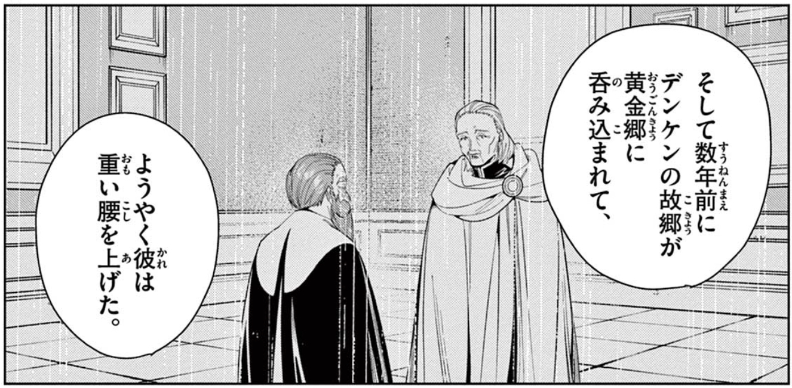

读日版《葬送的芙莉莲》时注意到了「重い腰を上げる」这个表达。
上下文中，因故乡遭变，邓肯在阔别 50 多年后准备重返这个伤心之地。

Weblio 上「重い腰」的意思是

> 物事を中々始めない気持ちや、やる気が出るまで時間がかかる気持ち、などを比喩的に言う表現。

用腰很重来比喻难以开始行动、没有干劲。
「重い腰を上げる」就是总算打起精神准备开始。我觉得很形象。
另一方面，这个词组也可以直译成“直起腰”“挺起腰杆”。
这在中文里也有比喻义，
通常是说一个人做了大事/赚了大钱，有了信心从而不再以卑微的姿态待人接物。

仔细想来，同一具体动作在两种语言中不同的抽象含义并非毫无关系：
迟迟无法行动，心里便会觉得低人一等；
而一旦能够克服恐惧开始做事，虽说仍可能因为业务的关系而向他人低头，
但至少不会再轻视自己，觉得自己一无是处。
当然，行动会带来新的问题，如不恰当应对就又会陷入自我怀疑、无行动的局面，
“腰”就因为“重起来”而弯下去。

另外，虽然中日意义不完全相同，但它们各自描述的都是一个行为，
行为本身又是心境变化的结果。
换个角度，如果把两个意义结合起来，我们就能看到成了心境背后的一个恶性循环。
因为觉得卑微、无意义，所以什么也不去做。
又因为什么也不做，得不到刺激，所以生活仍旧没有意义。
想到这里，我看了看长长的 todo-list, 只有第一页的 coffee talk, 明天要讲的讨论稿，
陷入了虚无。Blog 迁移倒是进展顺利，苦笑。

更新 RSS, 看到 [Prot](https://protesilaos.com) 最近公开的一篇
[邮件回复](https://protesilaos.com/commentary/2023-04-27-re-question-organizing-thoughts)，
提到了 all-or-nothing mindset, 其实也就是完美主义。
他说勿过于苛刻，用 here-and-now 去代替它，在 trial-and-error 中成长，才能最终打破这个循环。
老生常谈，但还是很难做到。
