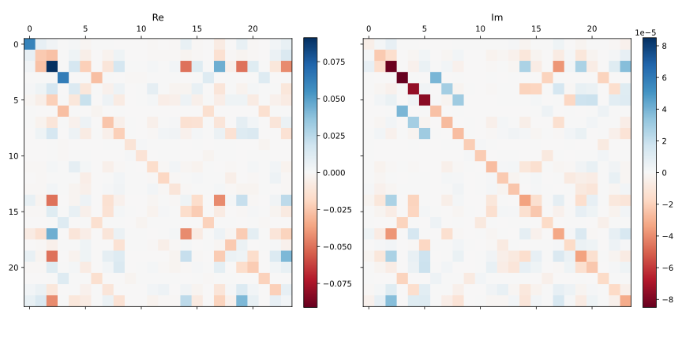

## Introduction

In this short post I will discuss how to get the full self-energy matrix from one-shot *GW* calculation.
The matrix element in Kohn-Sham state representation is expressed as \[[1](#citeproc_bib_item_1)\]

$$
\begin{equation}
\begin{aligned}
\Sigma^{G_0W_0}_{nn'}(\mathbf{k},i\omega)
=& -\frac{1}{2\pi} \int^{\infty}_{-\infty}\mathrm{d}{\omega'}\,
\sum_{m\mathbf{q}}\sum_{\mu\nu}\frac{W_{0,\mu\nu}(\mathbf{q},\mathrm{i}\omega')}
{\mathrm{i}\omega-\mathrm{i}\omega'+\mu-\epsilon_{m\sigma}^{\mathbf{q}'}}
C^{\mu}_{nm\sigma}(\mathbf{k},\mathbf{k}-\mathbf{q})
C^{\nu}_{mn'\sigma}(\mathbf{k}-\mathbf{q},\mathbf{k})
\end{aligned}
\end{equation}
$$

In practice, the frequency integral is discretized by certain quadrature grids and the integration limits is halved
by taking advantage of the parity of screened Coulomb $W$.

## Procedure to get self-energy matrix from FHI-aims

### Obtain and build a recent FHI-aims version

The functionality to compute and write the full self-energy in periodic systems is available in FHI-aims after
merging request [!1490](https://aims-git.rz-berlin.mpg.de/aims/FHIaims/-/merge_requests/1490) on April 24, 2024.
You need to pull the updates at your FHI-aims repository, or simply obtain the recent 240507 release tarball which
has the relevant commits included. This work can be considered as a first step to implement the self-consistent *GW*
for periodic systems.

Building this version does not require additional effort to the general `cmake` way as described [here](https://fhi-aims-club.gitlab.io/tutorials/cmake-tutorial/cmake_tutorial/).

### Prepare inputs for periodic GW calculation

As usual, you need to prepare the structure file `geometry.in` and task control file `control.in` to run
an FHI-aims calculation. The structure file for periodic system is best explained in the [FHI-aims basic tutorial](https://fhi-aims-club.gitlab.io/tutorials/basics-of-running-fhi-aims/3-Periodic-Systems/).

For the control file, the general keywords for periodic *GW* are necessary as explained in the [tutorial](https://fhi-aims-club.gitlab.io/tutorials/rpa-and-gw-for-molecules-and-solids/Part-2/#requesting-a-g0w0-calculation-for-periodic-solids),
but we need following extra keywords
```
periodic_gw_full_matrix .true.
output self_energy_matrix <nk> <nfreq> <seperate_xc>
```
Notes:
- `periodic_gw_full_matrix` is the switch to control whether to calculate the full self-energy matrix. Set to `.true.` to turn it on.
- `output self_energy_matrix` is the keyword to control which matrices should be exported.
  By default, the DFT XC and exchange-correlation self-energy matrices at all k-points and frequency grids will be dumped.
  The optional keyword `<nk>` and `<nfreq>` are integer numbers and specify the number of k-points and frequency grids you want to export.
  If they are specified, only the matrices at the first `<nk>` k-points and `<nfreq>` frequency grids will be written.
  The last optional `<seperate_xc>` is a boolean and specifies whether you want to have exchange and correlation matrices in seperate files.

### Run the calculation

After preparing the above inputs, we can run FHI-aims calculation as usual.
Note that the resources required for periodic GW is much more than normal DFT.
If the calculation ends successfully, you will get files like
```
SigXC_matr_spin_1_kpt_000001_freq_001.csc
SigXC_matr_spin_1_kpt_000001_freq_002.csc
...
xc_matr_spin_1_kpt_000001.csc
xc_matr_spin_1_kpt_000002.csc
...
```
The files `SigXC_matr_spin_{ispin:1d}_kpt_{ikpt:06d}_freq_{ifreq:03d}.csc` stores the self-energy matrix, and
`xc_matr_spin_{ispin:1d}_kpt_{ikpt:06d}.csc` stores the DFT xc potential matrix.

If you set `<seperate_xc>` to `.true.`, you will also find
```
Sigmac_matr_spin_1_kpt_000001_freq_001.csc
Sigmac_matr_spin_1_kpt_000001_freq_002.csc
...
exact_x_matr_spin_1_kpt_000001.csc
exact_x_matr_spin_1_kpt_000002.csc
...
```
with `Sigmac_matr_spin_{ispin:1d}_kpt_{ikpt:06d}_freq_{ifreq:03d}.csc` being the correlation self-energy matrix and
`xc_matr_spin_{ispin:1d}_kpt_{ikpt:06d}.csc` the Fock or exact exchange matrix.

The matrix data are stored in the ELSI CSC sparse matrix format and are in the Kohn-Sham orbital representation.
Note that with the conventional *GW* algorithm, the calculation of self-energy matrix scales as $\mathcal{O}(N^5)$, where
*N* is the number of atoms in the unit cell. This is one order higher than the usual *GW* calculation, which
only computes the diagonal elements $\Sigma_{nn}$.

## Example: single water molecule in a large box

The structure file `geoemtry.in`
```
atom      -0.0224546148       -0.0000353646       -0.0162226261    O
atom       0.0226952710        0.0000129083        0.9530701005    H
atom       0.9061016825        0.0000180931       -0.2977710918    H
lattice_vector 20.0  0.0  0.0
lattice_vector  0.0 20.0  0.0
lattice_vector  0.0  0.0 20.0
```

The control file `control.in` without basis set information
```
xc                pbe
relativistic      atomic_zora scalar
k_grid            1 1 1

# GW setup
qpe_calc          gw_expt
periodic_gw_full_matrix .true.
frequency_points  32
anacon_type       1
output gw_regular_kgrid
output k_eigenvalue 1
output self_energy_matrix 1 32 .true.

# Also write the overlap matrices and DFT Hamiltonian and eigenvectors
elsi_output_matrix eigenvectors
elsi_output_matrix hamiltonian
elsi_output_matrix overlap
```

Since we have specified the `elsi_output_matrix` keywords, we also get the overlap and Hamiltonian matrices in basis set representation.

## Post-processing the matrix file
The following Python snippet can be used to read the matrix output
into SciPy [`csc_matrix`](https://docs.scipy.org/doc/scipy/reference/generated/scipy.sparse.csc_matrix.html) object
(credit to Yi Yao and Victor Yu for the original version).
```python
def read_elsi_to_csc(fn):
    import struct
    import scipy.sparse as sp
    import numpy as np

    with open(fn, "rb") as h:
        data = h.read()
    i8 = "l"
    i4 = "i"

    # Get header
    start = 0
    end = 128
    header = struct.unpack(i8 * 16, data[start:end])

    # Number of basis functions (matrix size)
    n_basis = header[3]

    # Total number of non-zero elements
    nnz = header[5]

    # Get column pointer
    start = end
    end = start + n_basis * 8
    col_ptr = struct.unpack(i8 * n_basis, data[start:end])
    # print(col_ptr)
    col_ptr += (nnz + 1, )
    col_ptr = np.array(col_ptr)

    # Get row index
    start = end
    end = start + nnz * 4
    row_idx = struct.unpack(i4 * nnz, data[start:end])
    row_idx = np.array(row_idx)

    # Get non-zero value
    start = end

    if header[2] == 0:
        # Real case
        end = start + nnz * 8
        nnz_val = struct.unpack("d" * nnz, data[start:end])
    else:
        # Complex case
        end = start + nnz * 16
        nnz_val = struct.unpack("d" * nnz * 2, data[start:end])
        nnz_val_real = np.array(nnz_val[0::2])
        nnz_val_imag = np.array(nnz_val[1::2])
        nnz_val = nnz_val_real + 1j * nnz_val_imag

    nnz_val = np.array(nnz_val)

    # Change convention
    for i_val in range(nnz):
        row_idx[i_val] -= 1
    for i_col in range(n_basis + 1):
        col_ptr[i_col] -= 1

    return sp.csc_matrix((nnz_val, row_idx, col_ptr), shape=(n_basis, n_basis))
```
This snippet can be used to read any matrix file in ELSI CSC format generated from FHI-aims.

Note that the dimension of the resulted self-energy matrix may be smaller than the number of basis functions (the case for Hamiltonian and overlap matrices).
This is because the self-energy matrix are in Kohn-Sham representation, and the self-energy are not calculated for all Kohn-Sham states but only those close to the Fermi level.
The lower and upper bound of the QP states can be found by searching the standard output for
```
  Actual lower/upper states to compute self-energy:            3          10
```
In this case the resulted self-energ matrix should be 8 by 8, with the first index corresponding to the 3rd Kohn-Sham state.

The matrices generated above are $\Sigma_{nn'}$ ,
i. e. matrices in Kohn-Sham orbital or molecular orbital representation.
Since the eigenvectors can depend on the choice of solver up to a phase factor (or a unitary transformation for degenerate states),
its elements can be different when FHI-aims runs with different setup.
A better choice for comparison is the matrices in atomic orbital basis $\Sigma_{ij}$.
The two representations are connected by the Kohn-Sham eigenvectors

$$
\begin{equation}
\begin{aligned}
\mathbf{\Sigma}^{\rm KS} =& \mathbf{C}^{\dagger} \mathbf{\Sigma}^{\rm AO} \mathbf{C} \\
\mathbf{\Sigma}^{\rm AO} =& \left[\mathbf{C}^{\dagger}\right]^{-1} \mathbf{\Sigma}^{\rm KS} \mathbf{C}^{-1}
\end{aligned}
\end{equation}
$$

For non-orthogonal basis

$$
\begin{equation}
\mathbf{C}^{\dagger} \mathbf{S} \mathbf{C} = \mathbf{1},
\end{equation}
$$

thus

$$
\begin{equation}\label{eq:trans-ks2ao}
\mathbf{\Sigma}^{\rm NAO} = \mathbf{S} \mathbf{C} \mathbf{\Sigma}^{\rm KS} \mathbf{C}^{\dagger} \mathbf{S}
\end{equation}
$$

To make the transformation complex, we need to compute $\Sigma_{nn'}$ with $n$ and $n'$ running all available Kohn-Sham states.
This can be simply done by adding the following lines to `control.in`
```
state_lower_limit 1
state_upper_limit 999999
```
Running the calculation will give you all inputs to perform the transformation of Eq. \eqref{eq:trans-ks2ao}

```python
import numpy as np

sigma_ks = read_elsi_to_csc("./Sigmac_matr_spin_1_kpt_000001_freq_001.csc").toarray()
c = read_elsi_to_csc("./C_spin_01_kpt_000001.csc").toarray()
s = read_elsi_to_csc("./S_spin_01_kpt_000001.csc").toarray()
sigma_ao = s @ c @ sigma_ks @ np.conjugate(c.T) @ s
```

Below shows the AO self-energy matrix of water molecule at the first frequency point (0.00068497i Ha)
using the above input and light default species. The input and output files are available in `example.tar.gz`
([download link](./example.tar.gz)). It can be recognized that the self-energy matrix is complex,
but is symmetric instead of Hermitian as one expects in Hamiltonian or overlap matrix.
You can also try out some real extended system such as silicon.


_AO self-energy matrix of water molecule at 0.00068497i Ha_

## Summary

I have briefly introduced how to carry out periodic one-shot *GW* calculation in FHI-aims for full self-energy matrix.
The main keywords are explained, along with sample inputs for a water molecule in a super cell. A Python script is also provided
to read the matrix output files.

Since this functionality is quite new, bug might be expected.
Please feel free to reach me out whenever you feel necessary when trying it out.
We can discuss how to fix it. Thanks for reading.

## References

<span id="citeproc_bib_item_1"></span>\[1\] X. Ren et al., Phys.
Rev. Materials **5**, 013807 (2021)
<a href="https://doi.org/10.1103/PhysRevMaterials.5.013807"
target="_blank">[DOI]</a>.
