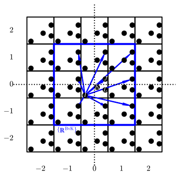
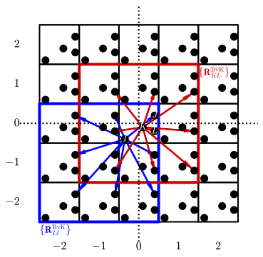

## Introduction

In atomic basis framework, the matrix representation of operator in
reciprocal space is calculated by Fourier transforming the real space
matrices

$$\begin{equation}\label{eq:ft}
\mathbf{A}(\bk) = \sum_{\bR} \ee^{\ii \bk \cdot \bR} \mathbf{A}(\bR)
\end{equation}$$

where the matrix elements

$$\begin{equation}\label{eq:def-AijR}
\begin{aligned}
A_{ij}(\bR) = \braket{\varphi_{i,\mathbf{0}}}{\hat{A}\varphi_{j,\bR}}
= \int\dd{\br}\dd{\br'} \varphi_{i,\mathbf{0}}(\br) A(\br,\br') \varphi_{j,\bR}(\br')
\end{aligned}
\end{equation}$$

and $\varphi_{i, \bR}$ is basis function located on atom $I$ in the unit
cell marked by vector $\bR$. For non-periodic $\mathbf{A}(\bR)$, as long
as it decays in real-space, one can employ a cut-off radius $R_c$ (for
isotropic system) where $\mathbf{A}(\abs{\bR}\ge R_c)$ is effectively
zero. Then the summation can be reduced to

$$\begin{equation}\label{eq:ft-rc}
\mathbf{A}(\bk) = \sum_{\abs{\bR} < R_c} \ee^{\ii \bk \cdot \bR} \mathbf{A}(\bR)
\end{equation}$$

Examples are overlap matrix and Hamiltonian matrix. For the latter, the
batch-based integration in FHI-aims is discussed in [a previous CN
post]().

Sometimes, rather than direct evaluation in real space using Eq.
\eqref{eq:def-AijR}, the real-space matrix is obtained by the inverse
Fourier transform of its counterpart in reciprocal space computed on a
finite set of $\bk$ points. In this case, matrix $A(\bR)$ is periodic
under the Born-von Karman (BvK) boundary condition. Note that this
period is artificial due to finite $\bk$ sampling. The unit cells within
a period then forms the so-called BvK super cell. The summation of Eq.
\eqref{eq:ft} is then constrained within the BvK super cell

$$\begin{equation}\label{eq:ft-bvk}
\mathbf{A}(\bk) = \sum_{\bR\in\{\bR^{\text{BvK}}\}} \ee^{\ii \bk \cdot \bR} \mathbf{A}(\bR)
\end{equation}$$

Note that the two equations become formally the same when the BvK cell
encloses the $R_c$ sphere.

## Fourier interpolation

For the periodic case, we can write explicitly the construction of
$\mathbf{A}(\bR)$ by inverse transform using the matrices on mesh points
$\\{\bk'\\}$, commensurate with the BvK cell in the Brillouin zone. By
commensurate, it means that for BvK cell with period $(N_1, N_2, N_3)$,
the mesh points are

$$\begin{equation}
\left\lbrace\bk'=\sum^3_{i=1} \frac{n_i}{N_i} \mathbf{b}_i \mid n_i = 0, 1, \ldots, N_i - 1\right\rbrace
\end{equation}$$

where $\mathbf{b}_i$ are the reciprocal lattice vectors of the unit
cell. Therefore,

$$\begin{equation}\label{eq:fourier-interpolation}
\begin{aligned}
\mathbf{A}(\bk) =&
\sum_{\bR\in\{\bR^{\text{BvK}}\}} \ee^{\ii \bk \cdot \bR} \mathbf{A}(\bR) \\
=& \sum_{\bR\in\{\bR^{\text{BvK}}\}} \ee^{\ii \bk\cdot \bR}
\frac{1}{N_{\bk'}}\sum_{\bk'}
\ee^{-\ii \bk'\cdot \bR} \mathbf{A}(\bk') \\
=& \sum_{\bk'} \mathbf{A}(\bk')
\frac{1}{N_{\bk'}} \sum_{\bR\in\{\bR^{\text{BvK}}\}} \ee^{\ii (\bk-\bk')\cdot \bR} \\
=& \sum_{\bk'} F(\bk,\bk') \mathbf{A}(\bk')
\end{aligned}
\end{equation}$$

This can be viewed as an interpolation scheme for $\mathbf{A}(\bk)$ from
$\\{\mathbf{A}(\bk')\\}$ with interpolation coefficients

$$\begin{equation}\label{eq:interp-coeff}
F(\bk,\bk') = \frac{1}{N_{\bk'}} \sum_{\bR\in\{\bR^{\text{BvK}}\}} \ee^{\ii (\bk-\bk')\cdot \bR}
\end{equation}$$

and we name it as Fourier interpolation.

## Choice of Born-von Karman cell

To compute the interpolation coefficients Eq. \eqref{eq:interp-coeff},
the BvK super cell has to be specified. Naively, it can be chosen the
same for the whole matrix $\mathbf{A}$. To illustrate, we look at a
2-dimensional case with 3 by 3 BvK super cell as shown in figure
[1](#fig:bvk_IJ_naive). The unit cell is a square one, and contains 4
atoms with fractional coordinates

- `I: (0.15, 0.10)`
- `J: (0.90, 0.70)`
- `K: (0.60, 0.40)`
- `L: (0.90, 0.30)`

The BvK cell is chosen to have `(0,0)` cell at its center, marked by the
blue square. The BvK super cell then contains unit cells $(n_1, n_2)$
with $n_1=0,\pm1$ and $n_2=0,\pm1$. The Fourier transform Eq.
\eqref{eq:ft-bvk} is then explicitly written as

$$\begin{equation}
\begin{aligned}
\mathbf{A}(\bk)=&\sum_{n_1=-1,0,1}\sum_{n_2=-1,0,1}
\ee^{\ii \bk \cdot (n_1\mathbf{a}_1 + n_2\mathbf{a}_2)} \mathbf{A}(n_1\mathbf{a}_1 + n_2\mathbf{a}_2) \\
\equiv&\sum_{n_1=-1,0,1}\sum_{n_2=-1,0,1}
\ee^{\ii \bk \cdot (n_1\mathbf{a}_1 + n_2\mathbf{a}_2)} \mathbf{A}(n_1, n_2)
\end{aligned}
\end{equation}$$

If we focus on block $\mathbf{A}_{IJ}$, whose row indices correspond to
basis on atom $I$ and column indices on $J$, we can visualize the
contributions $\mathbf{A}(n_1, n_2)$ by blue arrows in the figure.

_Figure 1: 3 by 3 BvK cell centered at (0,0) unit cell.
Blue arrows stand for the submatrices of $\mathbf{A}(\bR)$ with row index on atom $I$ and column on $J$._
This choice of BvK cell, however, is problematic from physical
consideration. Suppose that operator $\hat{A}$ is short-ranged, and a 3
by 3 BvK cell barely encloses the sphere of cut-off radius $R_c$. This
indicates that $\mathbf{A}_{IJ}$ is non-zero only within the BvK cell.
On the other hand, the atom $J$ in unit cell `(1,-1)` is farther from
atom $I$ in the center cell than its periodic image in cell `(-2,-1)`,
which implies by the decay property of $\hat{A}$ that

$$\begin{equation}
\norm{\mathbf{A}_{IJ}(-2,-1)} > \norm{\mathbf{A}_{IJ}(1,-1)} > 0
\end{equation}$$

Since cell `(-2,-1)` is outside of our choice of BvK cell, it
contradicts the condition that $\mathbf{A}_{IJ}$ is non-zero only within
the BvK cell. The same situation applies to `(-1,1)`, `(0,1)`, `(1,1)`,
and `(1,0)`.

A more physical scheme is to choose the BvK cell where the nearest
periodic images are included. For pair $IJ$, we can refine the BvK cell
in figure [1](#fig:bvk_IJ_naive) according to analysis above. The final
BvK cell for $IJ$ is $(n_1, n_2)$ with $n_1=0,-1,-2$ and $n_2=0,-1,-2$,
as illustrated in figure [2](#fig:bvk_physical). On the other hand, for
pair $KL$, the BvK cell in figure [1](#fig:bvk_IJ_naive) does include
the nearest images of $L$ and is hence an appropriate choice.

 _Figure
2: 3 by 3 BvK cell chosen for atom pairs $IJ$ (blue) and $KL$ (red)._ It
is therefore indicated that this scheme will lead to different choices
of BvK cells for each pair of atoms. We thus modify our interpolation
formula Eq. \eqref{eq:fourier-interpolation} to

$$\begin{equation}
\begin{aligned}
\mathbf{A}_{IJ}(\bk)
=&\sum_{\bk'} \mathbf{A}_{IJ}(\bk')
\frac{1}{N_{\bk'}} \sum_{\bR\in\{\bR_{IJ}^{\text{BvK}}\}} \ee^{\ii (\bk-\bk')\cdot \bR} \\
=&\sum_{\bk'} F_{IJ}(\bk, \bk')\mathbf{A}_{IJ}(\bk')
\end{aligned}
\end{equation}$$

where

$$\begin{equation*}
F_{IJ}(\bk, \bk') = \frac{1}{N_{\bk'}} \sum_{\bR\in\{\bR_{IJ}^{\text{BvK}}\}} \ee^{\ii (\bk-\bk')\cdot \bR}
\end{equation*}$$

The modified scheme for choosing BvK cell is shown to give smoother band
structure by Fourier interpolation in hybrid functional calculation in
FHI-aims, given the same Brillouin zone sampling.

## Summary

This note briefly discusses the Fourier interpolation technique to
obtain matrices in reciprocal space at arbitrary wave vector from those
at available $\bk$ vectors. When the matrices are represented by atomic
basis, the Born-von Karman cell used to compute the interpolation
coefficient should be chosen for each atom pairs to make the
interpolation of more physical meaning.

Discussion with Andrey Sobolev at [MS1P](https://ms1p.org) is kindly
appreciated.
