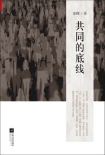

这本书是秦晖教授探讨中国当代问题的一部论说文集。 它从统领思想的 "主义"
和其 "左右" 之争着手，通过整体分析和对经济、政治和文化部门的讨论，
试图厘清一条中国社会各方面所应当遵循的共同"底线"，为改革明确方向。
这条底线并不存在于象征右派的自由主义和象征左派的社会民主主义之外，而是取两者交集的核心观念：自由与公正。

在政府职能方面，他认为主张"自由放任"的右派与建构"福利国家"的左派之间的矛盾在中国并不存在。
恰恰相反，中国是 \"既要更多的自由放任又要更多的福利国家\" (P19)。
真正的矛盾在两个方面： 一是中国的自由主义应和寡头主义划清界限，
二是中国的社会民主主义应该和民粹主义划清界限 (P33)。
在经济上，因为规则公平远未实现，公平与效率的矛盾在当下中国还未成为\"真问题\"
(P225)。 真正要警惕的则是不公平规则下不受制约的权力像尺蠖一样时左时右，

> 先以 "左" 的名义抢劫，再以 "右" 的名义分赃。 以 "社会主义"
> 为名化平民之私为 "公"，以 "市场经济" 为名化 "公" 为权贵之私。 ------
> P249

强制是过去一切灾难与错误之过，而非某种"乌托邦狂热" (P110), 起源于
"反竞争的伪公正" 和 "不公正的伪竞争" 的恶性循环 (P167).
改革的目的应当是告别强制：既反对强制化公为私，又要反对强制化私为公
(P34). 在社会生活的公私分界上，左右两派的底线代表着 (P80)

> 1.  私域自由、公域民主
> 2.  私域公域必须划分而不能混为一谈
> 3.  最基本领域的公域私域之分上左右的共识

可在中国，公共权力限制以至管制左右双方均承认的私人领域已不是新闻（尤其是新冠之后），
而在西方无论左右派都认为的公共领域的地方，包括 "公共权力"
本身，又偏偏为个人意志和小集团利益所支配 (P80)。
在文化上，他认同文化多元，但同时强调 "自由优先于文化"，
即多元文化并存的前提是每个人有选择的自由：
儒学、基督教、伊斯兰教等等应当多元并存，但异端审判与信仰自由不可以
(P331).
进一步说，自由民主人权与压迫专制奴役并非文化之别，而是普遍意义上相对立的价值观，
对前者的拒斥意味着对后者的接受。

这本书出版于 2013 年，但实际所收录文章均在 2003 年前写就，
是他另一部书《问题与主义》 (1999 年) 的 "续篇"。 在 20
年后的今天读来，这些文章仍鲜明映照着中国的社会现实。

 _书封
([豆瓣](https://book.douban.com/subject/21432137),
[Amazon](https://www.amazon.com/dp/7539956828))_
