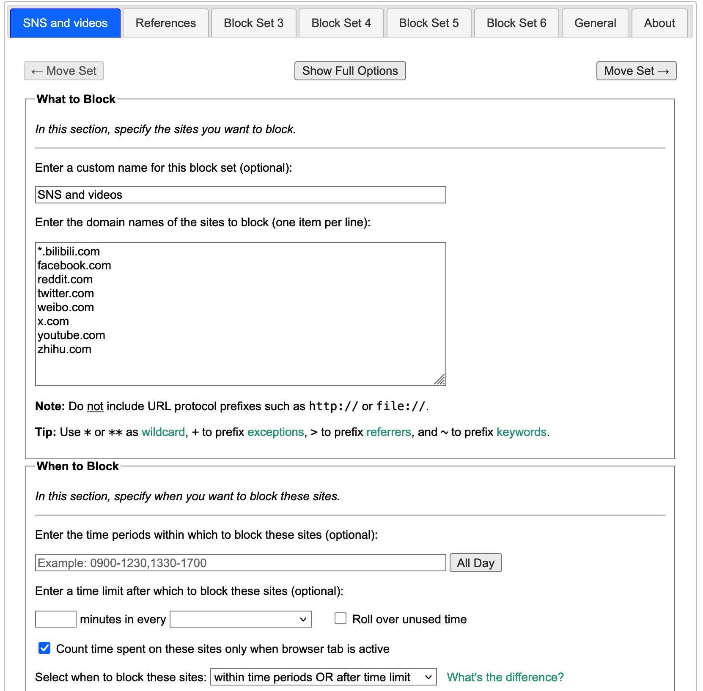
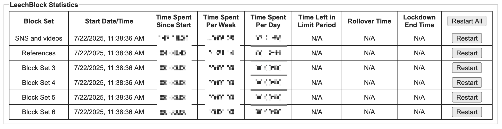
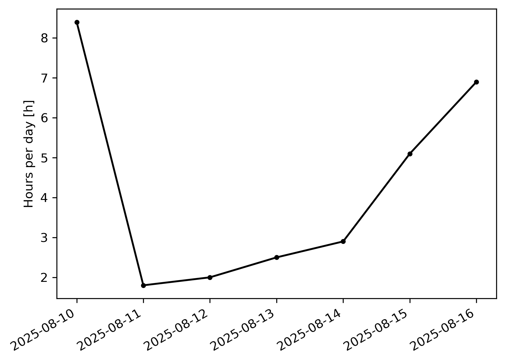

## Problem

Recently I have been increasingly relying on social network service (SNS) and video sites
to check news or get relief from day to day stress. However, many have claimed that news and SNS
is actually one important source of pressure and anxiety.
Thus I started my attempt to get rid of those sites.

## LeechBlock for website blocking and statistics

At the beginning, I just want to block those sites.
To this end I found [LeechBlock](https://www.proginosko.com/leechblock/) very useful.
It is a web browser extension designed to block certain websites according to different rules such as
fixed time windows and time limit.

To make LeechBlock work, I need first to set it up to make it aware of the websites to block.
In the `Options` tab of LeechBlock, it offers customizable blocking rules up to 30 sets.
I name one of them as "SNS and videos", and enter the domains of relevant websites,
either by wildcard or secondary subdomain. This is shown in Figure [1](#fig:lb_setup).


_Figure 1: Rule setup in Options_

However, this does not really help to reduce the time I use on these sites.
When I got stressed, I will open my browser and type an SNS or video site.
This behavior itself already break my last action and costs some time.
In the case when I feel extremely disturbed and compulsory, I will use the "Override" tab to give me a few minutes of "mercy time"
to access the website. This simply breaks the original idea of blocking, and actually adds to the stress with a sense of guilt.

I realize that the problem lies in my mind being unconscious of what I am doing.
The block seems to add a barrier between me and the websites,
but it is just a technical hassel rather than a comfort for the uneasy mind.
With an old Chinese idiom "堵不如疏", *Better to channel than to block*,
I decide to disable the block, but try to track and record my own surfing hours, which I will use to reflect on my behavior and thoughts.

Fortunately, I noticed the `Statistics` tab of LeechBlock.
For each rule set, it shows the time that you have spent on the websites that match the wildcards,
and also computes the weekly and daily usage (Figure [2](#fig:lb_stat)).
The hours per day can be also computed by checking the "Time Spent Since Start" column
at the beginning and the end of the day.


_Figure 2: LeechBlock statistics. Blurred for privacy. but the "Time Spent Per Day" as of writing was close to 7 hours ... you see the problem_

<!--  -->

To track this daily usage, I turn to my old friend Emacs and org-mode.

## Org-mode table for tracking

For record, I create the following table in an org-mode file.
The "Total start" and "Total end" columns are extracted directly from the statistics page.
"Est. Mobile" gives an estimate of non-PC-browser usage of SNS (brower and apps on mobile devices).
"Today" column is computed from these three columns.
The last row displays the average hours of all dates with a record.

```
#+name: tab-sns-clocks
| Date             | Total start | Total end | Est. Mobile [h] | Today [h] |
|------------------+-------------+-----------+-----------------+-----------|
| [2025-08-10 Sun] |   146:30:02 | 147:13:22 |             1.0 |       1.7 |
|------------------+-------------+-----------+-----------------+-----------|
|                  |             |           |                 |       1.7 |
#+tblfm: $5='(+ (my/time-diff-hours $3 $2) (string-to-number $4));%.1f::@>$5=vmean(@I..@-1);%.1f
```

Computing "Today" manually is easy but boring. As always, this can be done programmatically
with Emacs Lisp. Here a table formula `#+tblfm` is set up, using a custom function `my/time-diff-hours`
to convert and compare two LeechBlock time strings, and add the estimated mobile time.
The implementation was done by ChatGPT.

```emacs-lisp
(defun my/time-diff-hours (time1 time2 &optional absolute unit)
  "Return (TIME1 - TIME2) in hours as a float.
TIME1 and TIME2 can be \"HH:MM:SS\", \"MM:SS\", or \"SS\" (seconds may be float).
If ABSOLUTE is non-nil, return |TIME1 - TIME2|."
  (let* ((s1 (my/time-string->seconds time1))
         (s2 (my/time-string->seconds time2))
         (diff (- s1 s2)))
    (when absolute (setq diff (abs diff)))
    (pcase (or unit 'hour)
      ('day    (/ diff 86400.0))
      ('hour   (/ diff 3600.0))
      ('minute (/ diff 60.0))
      ('second (float diff))
      (_ (user-error "Unknown unit: %S" unit)))))
```

The conversion function `my/time-string->seconds` is below.
```emacs-lisp
;; function to compute time difference ""
(defun my/time-string->seconds (s)
  "Convert S to total seconds.
Accepts \"HH:MM:SS\", \"MM:SS\", or \"SS\" (seconds may be float).
Allows hours > 24, and minute/second overflow (they’re just summed).
Leading + or - and surrounding whitespace are allowed."
  (unless (and s (stringp s))
    (user-error "Expected a time string, got: %S" s))
  (let* ((str (string-trim s))
         (sign (if (and (> (length str) 0)
                        (member (aref str 0) '(?- ?+)))
                   (prog1 (if (eq (aref str 0) ?-) -1 1)
                     (setq str (substring str 1)))
                 1))
         (parts (split-string str ":" t "[ \t]+"))
         (nums  (mapcar #'string-to-number parts))
         (h 0) (m 0) (sec 0.0))
    (pcase (length nums)
      (3 (setq h (nth 0 nums) m (nth 1 nums) sec (nth 2 nums)))
      (2 (setq m (nth 0 nums) sec (nth 1 nums)))
      (1 (setq sec (nth 0 nums)))
      (_ (user-error "Bad time format: %S" s)))
    (* sign (+ (* h 3600) (* m 60) sec))))
```

The mean value is computed by the internal function `vmean` provided by org-table.

## Statistics extraction from LeechBlock NG IndexDB database

A workflow would be to manually check the LeechBlock statistics in the morning and night routines, record in the fields and execute the table block.
But there is room for automation. The starting time should just be the ending time of the last day.
Further, if the statistics from LeechBlock can be accessed by command line, the ending time can be filled by table formula,
making this workflow complete by single click at the end of the day.

LeechBlock stores the statistics data in the Firefox extension data folder,
`storage/default/moz-extension+++UUID/idb` under the profile folder, with `UUID` being the number string of statistics webpage.
On macOS, personal profile folder lies at `$HOME/Library/Application Support/Firefox/Profiles`.
In my case, the database file has fixed name `3647222921wleabcEoxlt-eengsairo.sqlite`, which indicates its [SQLite](https://sqlite.org/fileformat2.html) file format.
Hence it can be queried from command line by `sqlite3` or Python scripts via `sqlite3` module.
In the database, the time data is stored in the `timedata#` object as an array of numbers with `#` being the option block set number,
as [pointed out](https://github.com/proginosko/LeechBlockNG/issues/630#issuecomment-3210908163) by LeechBlock's creator.

One tricky point is that the database for extension storage dumped by Firefox adopts the
[IndexedDB](https://developer.mozilla.org/en-US/docs/Web/API/IndexedDB_API/Using_IndexedDB) format,
which have both keys and values encoded. Specifically, the data values are Structure Clone compressed in the [snappy](https://en.wikipedia.org/wiki/Snappy_(compression)) format.
So the database cannot be handled as straightforwardly as the Zotero one.
Fortunately, the nice [moz-idb-edit](https://gitlab.com/ntninja/moz-idb-edit) package provides all necessary tooling I need to handle IndexDB.
It uses [cramjam](https://github.com/milesgranger/cramjam) to decompress the Structure Clone object.

By adopting the command line tool moz-idb-edit provides, I create the following script to extract the total time data and convert it to the required format.

```python
import sqlite3
import pathlib
from mozidbedit import mozidb, IDBObjectWrapper
import jmespath

profile_name = "xxxxxxxx.default-release"
ext_uuid = "62c60e3c-6869-4ed0-b04a-2daa931538b8"
i_option = 1

# almost fixed on macOS
key_name = f"timedata{:i_option}"
mozdir = pathlib.Path.home() / "Library" / "Application Support" / "Firefox"
profile_base = mozdir / "Profiles"
profile_dir = profile_base / profile_name
storage_path = profile_dir / "storage" / "default"
ctx_id = "4294967295"
db_path = storage_path / f"moz-extension+++{ext_uuid}^userContextId={ctx_id}" / "idb" / "3647222921wleabcEoxlt-eengsairo.sqlite"

try:
   with mozidb.IndexedDB(db_path) as conn:
       value = jmespath.search(key_name, IDBObjectWrapper(conn))
       # total time since start, in seconds, rounded to lower
       secs_total = int(value[1])
except sqlite3.OperationalError:
    # case that the database is locked
    secs_total = 0

# Convert to %H:%m:%S format
hours = secs_total // 3600
secs_total -= hours * 3600
mins, secs = secs_total // 60, secs_total % 60
print(f"{hours}:{mins:02d}:{secs:02d}")
```

This script is saved as `extract_lb_stat.py`.
The last step is to add the table formula to fill in the second and third column cells in the first data row.
```diff
  #+name: tab-sns-clocks
  | Date             | Total start | Total end | Est. Mobile [h] | Today [h] |
  |------------------+-------------+-----------+-----------------+-----------|
+ | [2025-08-11 Mon] |             |           |                 |           |
  | [2025-08-10 Sun] |   146:30:02 | 147:13:22 |             1.0 |       1.7 |
  |------------------+-------------+-----------+-----------------+-----------|
  |                  |             |           |                 |       1.7 |
+ #+tblfm: @<<$2='(message @<<<$3)::@<<$3='(shell-command-to-string "extract_lb_stat.py")
  #+tblfm: $5='(+ (my/time-diff-hours $3 $2) (string-to-number $4));%.1f::@>$5=vmean(@I..@-1);%.1f
```

## Visualization

To provide a better view of the trend, I turn to matplotlib to plot the daily usage against date.
The following code is used

```python
def plot(tbl, figname: str):
    import datetime as dt
    import matplotlib.pyplot as plt
    import matplotlib.dates as mdates

    # strip header and overall average
    dates = [x[0][1:11] for x in reversed(tbl[1:-1])]
    x = [dt.datetime.strptime(d,'%Y-%m-%d').date() for d in dates]
    y = [x[4] for x in reversed(tbl[1:-1])]

    fig, ax = plt.subplots(1, 1)

    interval = max(1, int(x[-1].day - x[0].day) // 6)
    ax.xaxis.set_major_locator(mdates.DayLocator(interval=interval))
    ax.xaxis.set_major_formatter(mdates.DateFormatter('%Y-%m-%d'))
    ax.plot(x, y, marker="o", color="k")

    ax.set_ylabel("SNS usage per day [h]")
    fig.autofmt_xdate()
    fig.savefig(figname,
                dpi=300,
                bbox_inches='tight',
                pad_inches=0.1)
```

Here `tbl` is a list, as which the org-mode table is parsed.
The above code is surrounded by a source code block named as `func-plot`.
Then the following block is added for org-babel to run and display the output figure.
```
#+name: run-plot
#+header: :noweb strip-export
#+header: :var tbl=tab-sns-clocks figname="sns_plot.png"
#+begin_src python :results file :exports both
<<func-plot>>
plot(tbl, figname)
return figname
#+end_src

#+name: fig-plot
#+attr_org: :width 600
#+results: run-plot
```
Running the code will give figure [3](#fig:sns_plot) and
add link to the figure under the `#+results` section.
Note that `figname` must be returned to make sure that the correct file link is inserted.


_Figure 3: Sample output figure_

