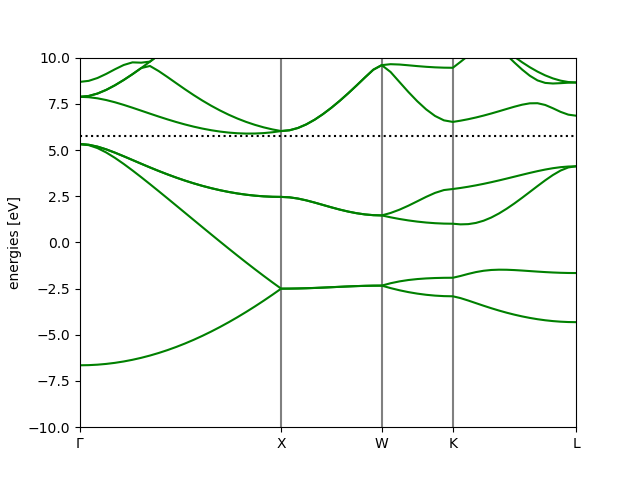
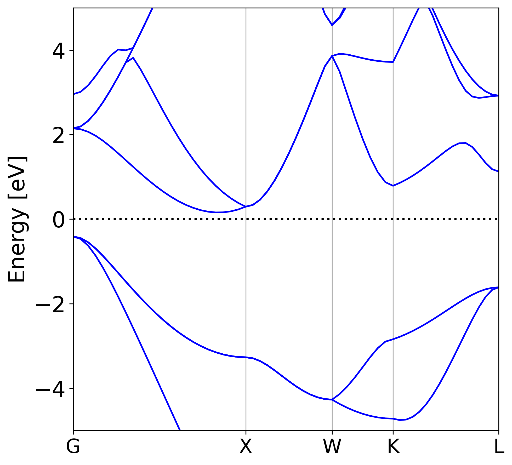

## Foreword

[GPAW](https://wiki.fysik.dtu.dk/gpaw/index.html) is a Python package to perform first-principles
calculations of molecules and extended systems. It has implementations in both plane-wave and
atomic orbitals and provides tools to compute various properties of materials, including the basic
self-consistent-field (SCF) calculation, structure optimization, etc.

Back to 2018 and 2019 I wrote a series of GPAW tutorials to teach myself, along with an introductory
[talk](https://github.com/minyez/quick-tutor-on-gpaw-gwbse) on how to use the code for computing 
electronic band structure and optical properties.
I have not used it since the paper[^1] with results out of that practice was published,
Recently I need to quickly perform some plane-wave calculations as reference for those with atomic basis.
With no access to the VASP code, I reminded myself of GPAW my old buddy.

A few years have passed and it is now 2025. Things have changed since then,
among which the most relevant is that the Intel compiler toolchain, on which my old tutorial is based,
is no longer available on my MacBook Pro with Apple Silicon chip.
GPAW has also been actively developed, so it would be better to refresh myself by going through the steps.
Here I take down some notes on installing following the latest documentation of
[customized installation](https://gpaw.readthedocs.io/install.html#customizing-installation)
and running basic examples.

## Download and install

To compile the C code base of GPAW with MPI support,
a MPI compiler and OpenBLAS/ScaLAPACK libraries are required.
For MPI implementation, I use MPICH from homebrew. Their installation has been
discussed in my post about [installing FHI-aims on macOS Sonoma]().
Besides, the [Libxc](https://libxc.gitlab.io) library is also installed via homebrew
```shell
brew install libxc
```
It can also be installed later in the Python environment as will be mentioned below,
but as Libxc is quite common and may be used for other projects, I prefer to have it somewhere globally.


Then create a Python environment dedicated to GPAW, e.g., using [micromamba](https://mamba.readthedocs.io),
and install a few dependencies
```shell
micromamba create -n env-gpaw python=3.12.8
micromamba activate env-gpaw
micromamba install matplotlib numpy scipy ase
```

Download the GPAW source code by checking out a recent tag
```shell
mkdir -p ~/.gpaw
cd ~/software
git clone -b 25.7.0 https://gitlab.com/gpaw/gpaw.git
cd gpaw
cp siteconfig_example.py ~/.gpaw/siteconfig.py
```

`siteconfig.py` is for specifying dependencies. The following works with the prerequisites as installed above
```python
# vim ~/.gpaw/siteconfig.py
compiler = 'mpicc'
libraries = []

# Math
libraries += ['blas']
scalapack = True
# Enable advanced IntelMKL specific scalapack functions (pzgeevx)
# intelmkl = True
if scalapack:
    library_dirs += ["/opt/packages/scalapack/2.2.0/gcc-13.4.0-mpich-4.3.0-openblas",]
    libraries += ['scalapack']

# - dynamic linking of Libxc (requires rpath or setting LD_LIBRARY_PATH at runtime):
libxc = True
if libxc:
    xc = "/opt/homebrew/Cellar/libxc/7.0.0/"
    include_dirs += [xc + 'include']
    library_dirs += [xc + 'lib']
    runtime_library_dirs += [xc + 'lib']
    if 'xc' not in libraries:
        libraries.append('xc')

# Enable OpenMP
extra_compile_args += ['-fopenmp']
extra_link_args += ['-fopenmp']
```
Then install by
```shell
pip install .
```
After GPAW is successfully built, sertial and parallel tests can be run:
```
$ gpaw test
 -------------------------------------------------------------------------------------------------------------------------
| python-3.12.8           /Users/minyez/micromamba/envs/env-gpaw/bin/python3.12                                           |
| gpaw-25.7.0-9de644511e  /Users/minyez/software/gpaw/gpaw/                                                               |
| ase-3.26.0              /Users/minyez/micromamba/envs/env-gpaw/lib/python3.12/site-packages/ase/                        |
| numpy-2.3.2             /Users/minyez/micromamba/envs/env-gpaw/lib/python3.12/site-packages/numpy/                      |
| scipy-1.16.1            /Users/minyez/micromamba/envs/env-gpaw/lib/python3.12/site-packages/scipy/                      |
| gpaw_data-1.0.1         /Users/minyez/micromamba/envs/env-gpaw/lib/python3.12/site-packages/gpaw_data/                  |
| libxc-7.0.0             yes                                                                                             |
| _gpaw-9de644511e        /Users/minyez/micromamba/envs/env-gpaw/lib/python3.12/site-packages/_gpaw.cpython-312-darwin.so |
| MPI enabled             yes                                                                                             |
| OpenMP enabled          yes                                                                                             |
| GPU enabled             no                                                                                              |
| GPU-aware MPI           no                                                                                              |
| cupy-fake               /Users/minyez/software/gpaw/gpaw/gpu/cpupy/__init__.py                                          |
| MAGMA                   no                                                                                              |
| scalapack               yes                                                                                             |
| Elpa                    no                                                                                              |
| FFTW                    no                                                                                              |
| libvdwxc                no                                                                                              |
| PAW-datasets (1)        /Users/minyez/micromamba/envs/env-gpaw/lib/python3.12/site-packages/gpaw_data/setups            |
 -------------------------------------------------------------------------------------------------------------------------
Doing a test calculation (cores: 1): ... Done

$ gpaw -P 4 test
# ...
Doing a test calculation (cores: 4): ... Done
```

## Quick example: silicon band structure

Step 1: perform a ground state SCF calculation.
Prepare script `gs.py` as below
```python
from ase.build import bulk
from gpaw import GPAW, PW, FermiDirac

si = bulk('Si', 'diamond', a=5.43)
calc = GPAW(mode=PW(200),
            xc='PBE',
            kpts={'size': (8, 8, 8), 'gamma': True},
            random=True, occupations=FermiDirac(0.01), txt='Si_gs.txt')
si.calc = calc
si.get_potential_energy()

# Save converged results
calc.write('Si_gs.gpw')
```
Then issue
```shell
mpirun -np 4 gpaw python gs.py
```
The computation log is saved to `Si_gs.txt` and
data including converged eigenvalues, occupation numbers and eigenvectors
are saved in `Si_gs.gpw`

Step 2: perform non-self-consistent band structure calculation with a specified band path using converged SCF data, `bs.py`.
Run the same command for this script (`mpirun -np 4 gpaw python bs.py`).
The band structure will be plotted and saved to `Si_bs.png` (see Figure [1](#fig:Si_bs)).
```python
from gpaw import GPAW

calc = GPAW('Si_gs.gpw').fixed_density(
    nbands=16, symmetry='off',
    kpts={'path': 'GXWKL', 'npoints': 60},
    convergence={'bands': 8}, txt='Si_bs.txt')
calc.get_potential_energy()
calc.write('Si_bs.gpw')

bs = calc.band_structure()
print(type(bs))  # <class 'ase.spectrum.band_structure.BandStructure'>

# show set to False to avoid opening multiple matplotlib instance with mpirun
ax = bs.plot(show=False, emax=10.0, filename="Si_bs.png")
```


_Figure 1: Silicon band structure_

While `BandStructure.plot` is handy to get a quick look at the results,
an alternative and fundamental way is to access the raw data saved in `Si_bs.gpw`.
```python
#!/usr/bin/env python3
from gpaw import GPAW
import numpy as np
import matplotlib.pyplot as plt
plt.rcParams["font.size"] = 20

c = GPAW('Si_bs.gpw')
bs = c.band_structure()

# Band energies
eigens = bs.energies  # shape (1, 60, 16)
# equivalent to
eigens = np.array([[c.get_eigenvalues(ik, isp)
                    for ik, _ in enumerate(c.get_ibz_k_points())]
                   for isp in range(c.get_number_of_spins())])

efermi = c.get_fermi_level()

# Occupation numbers
occs = np.array([[c.get_occupation_numbers(ik, isp)
                  for ik, _ in enumerate(c.get_ibz_k_points())]
                 for isp in range(c.get_number_of_spins())])
# normalize to [0, 2] for non-spin-polarized case
occs *= len(c.get_bz_k_points())

# k-path information: 1D coordinates and symbols of special points
x, x_spec, symbol_spec = bs.path.get_linear_kpoint_axis()
print(symbol_spec)   # ['G', 'X', 'W', 'K', 'L']

# Customized plot
fig, ax = plt.subplots(1, 1, figsize=(7, 7))
ax.plot(x, eigens[0, :, :] - efermi, color="b")

ax.set_xlim(xmin=x[0], xmax=x[-1])
ax.set_ylim(ymin=-5, ymax=5)
ax.set_ylabel("Energy [eV]")
ax.axhline(0.0, color='k', linestyle=':', lw=2)
ax.xaxis.set_ticks(x_spec, symbol_spec, fontsize=18)
ax.xaxis.grid()

fn = "Si_bs_manual.png"
fig.savefig(fn,
            dpi=300,
            bbox_inches='tight',
            pad_inches=0.1)
```
The above script uses Fermi level as reference energy zero, and generates
band structure plot as Figure [2](#fig:Si_bs_manual)


_Figure 2: Silicon band structure without using `BandStructure.plot` method_

## Afterwords

I do not know if there will be (2), but it is interesting to see that most
parts of my old tutorials work, which indicates the stability of GPAW APIs.
Thus it may be of help to review and share them here.

------------------------------------------------------------------------

[^1]: M. Zeng, et al. <a href="https://doi.org/10.1038/s41563-020-0622-y" target="_blank">Bandgap Tuning of Two-Dimensional Materials by Sphere Diameter Engineering</a>, Nature Mater. **19**, 528 (2020).
